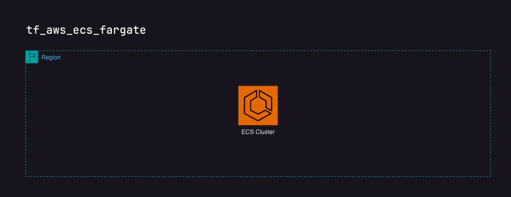

# tf_aws_ecs_fargate

The tf_aws_ecs_fargate repository provides Terraform scripts to set up an ECS Fargate cluster. It includes:

	•	ECS Cluster: Creates an ECS cluster with Fargate and Fargate Spot capacity providers.
	•	Variables: Allows configuration of the cluster name and weights for capacity providers.

Key Inputs:

	•	Cluster name
	•	Weights for Fargate and Fargate Spot capacity providers

Outputs:

	•	ECS cluster ARN

## Requirements

| Name | Version |
|------|---------|
|  [aws](#requirement\_aws) | ~> 5 |

## Providers

| Name | Version |
|------|---------|
|  [aws](#provider\_aws) | ~> 5 |

## Modules

No modules.

## Resources

| Name | Type |
|------|------|
| [aws_ecs_cluster.default](https://registry.terraform.io/providers/hashicorp/aws/latest/docs/resources/ecs_cluster) | resource |
| [aws_ecs_cluster_capacity_providers.fargate](https://registry.terraform.io/providers/hashicorp/aws/latest/docs/resources/ecs_cluster_capacity_providers) | resource |

## Inputs

| Name | Description | Type | Default | Required |
|------|-------------|------|---------|:--------:|
|  [cluster\_name](#input\_cluster\_name) | Name of the ECS cluster | `string` | n/a | yes |
|  [fargate\_spot\_weight](#input\_fargate\_spot\_weight) | Weight for the FARGATE\_SPOT capacity provider | `number` | `1` | no |
|  [fargate\_weight](#input\_fargate\_weight) | Weight for the FARGATE capacity provider | `number` | `1` | no |

## Outputs

| Name | Description |
|------|-------------|
|  [ecs\_cluster\_arn](#output\_ecs\_cluster\_arn) | The ARN of the ECS cluster |
